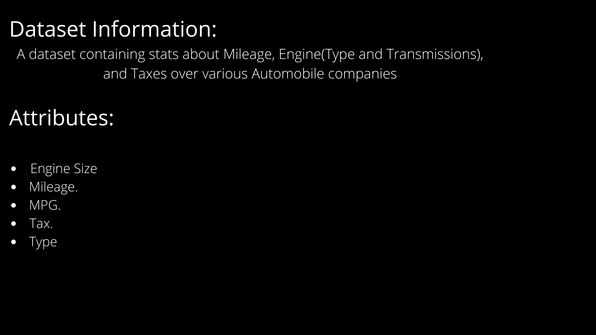
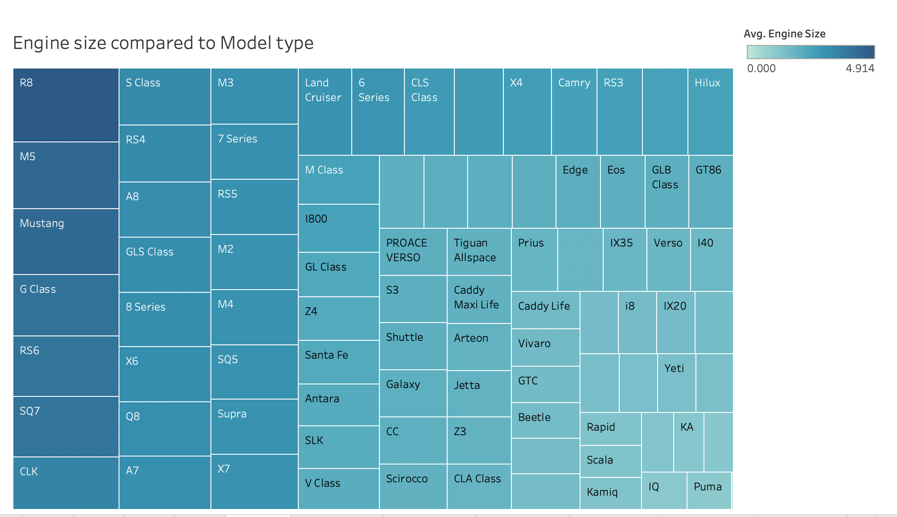
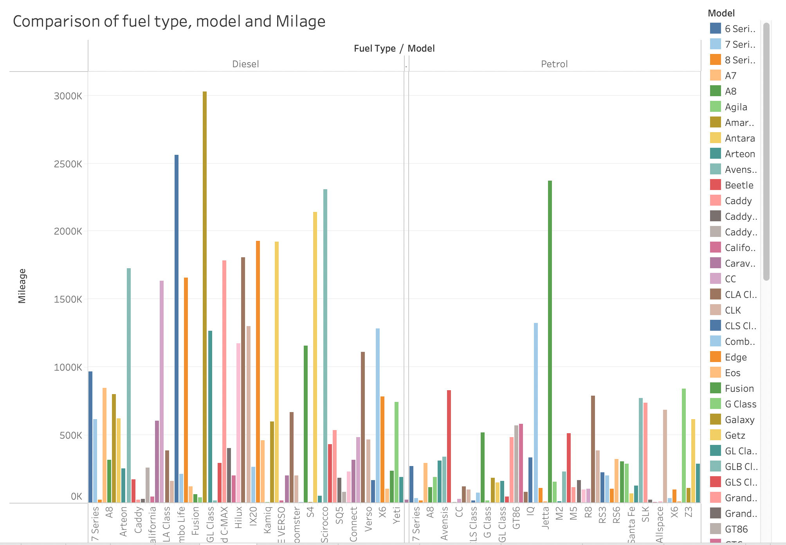
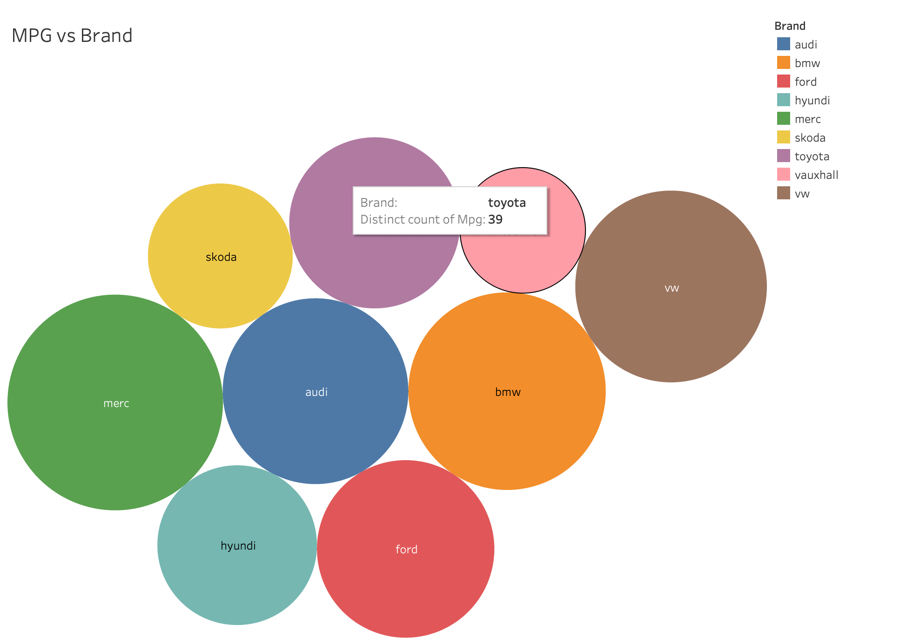
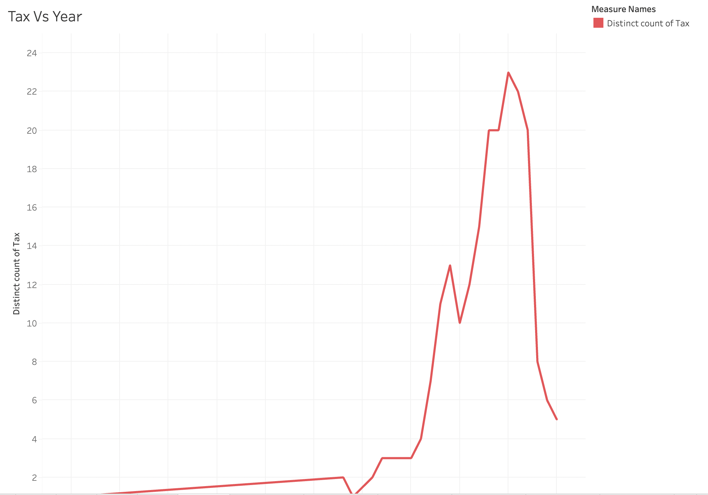
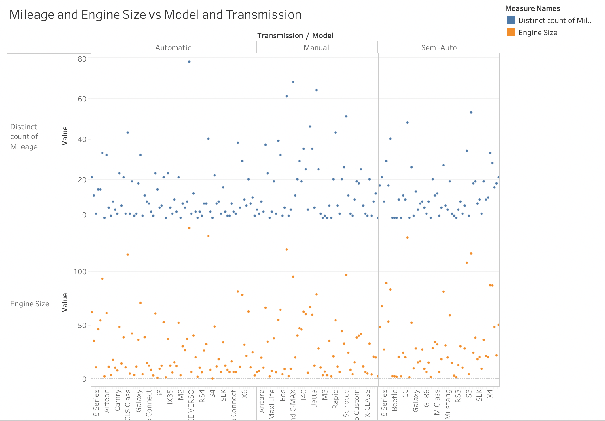
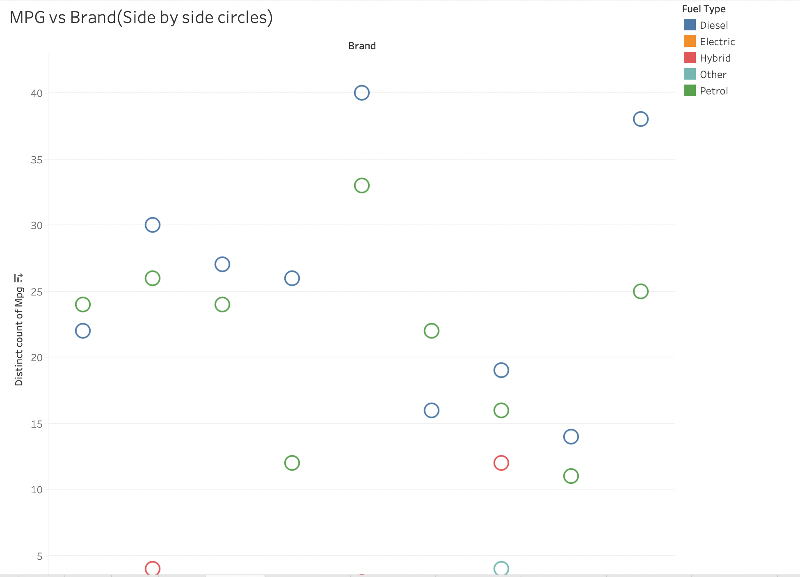
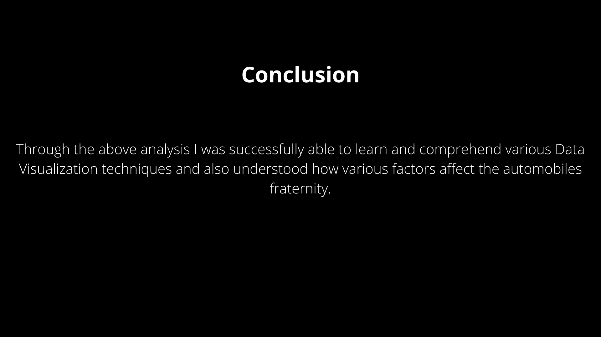

# DataVisualizationAutoMobile

## Statistical Analysis and Breakdown of Automobile data over the world for past 50 years. Graph work attached below.

### Analysis and Visualization

## Contributors
- Jay Malve(16010120178)
